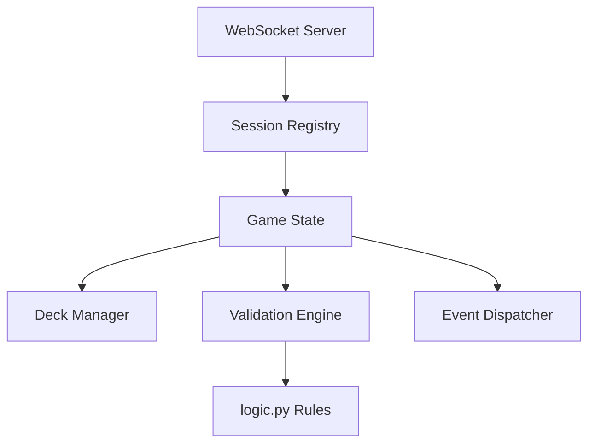

# Arabian Rummy Server Architecture

## Core Components

### 1. WebSocket Server
- **Location**: `server.py`
- **Responsibilities**:
  - Handle bidirectional client connections
  - Manage matchmaking queue
  - Route game events between players
  - Enforce message format:
    ```json
    {
      "type": "move|draw|discard|run_submit|chat",
      "player": "player_id",
      "data": {}
    }
    ```

### 2. Game Session Manager


### 3. State Management
- **Schema**:
  ```python
  {
    "deck": [Card],          # Shared draw pile
    "discard": [Card],       # Top card visible
    "players": {
      "player1": {
        "hand": [Card],      # Private cards
        "runs": [[Card]]     # Validated runs
      },
      "player2": {
        "hand": [Card],
        "runs": [[Card]]
      }
    },
    "turn": "player1|player2",
    "phase": "draw|play|discard"
  }
  ```

### 4. Validation Engine
- **Key Checks**:
  - Run validation using [`logic.validate_run()`](logic.py:3-21)
  - Card ownership verification
  - Turn sequence enforcement
  - Move legality (draw sources, discard timing)

### 5. Deployment Strategy
- **Infrastructure**:
  - Containerized using Docker
  - Redis for session storage
  - Load balancer with health checks
  - Automated scaling based on player count

## Security Measures
- Session token validation
- Message payload sanitization
- Rate limiting (10 req/sec per connection)
- State checksum verification

## Next Steps
1. Implement base WebSocket server
2. Create game session prototype
3. Integrate validation from [`logic.py`](logic.py)
4. Add state synchronization